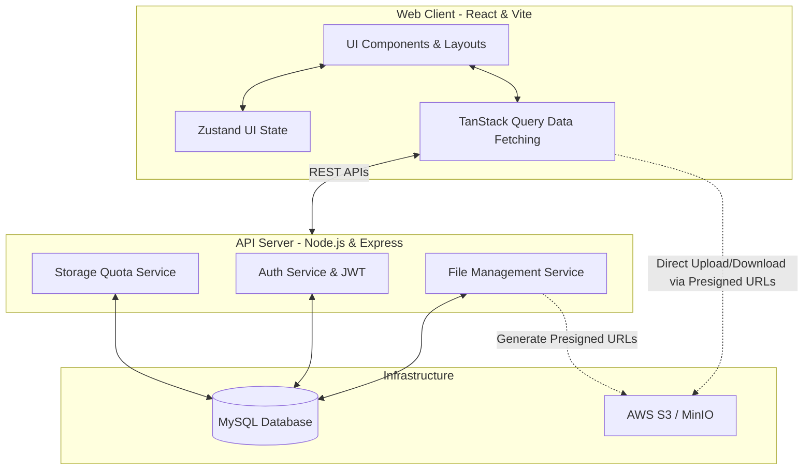
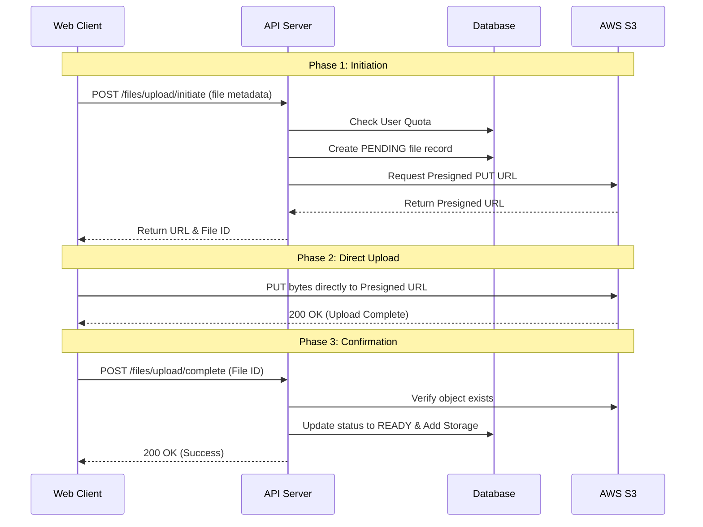

# FileEx — Enterprise Cloud Storage Platform

<div align="center">
  <p>A full-stack, secure, and highly scalable cloud file management system featuring direct-to-S3 uploads, recursive soft-deletion, and a modular architecture.</p>
</div>

---

## 🚀 Features

- **Direct-to-Cloud Uploads**: A two-phase upload flow using AWS S3 Presigned URLs prevents server bottlenecking and allows for massive scalability.
- **Advanced File Management**: Full support for deeply nested folders, renaming, moving, and breadcrumb navigation.
- **Smart Trash System**: Recursive soft-deletion ensures that when a folder is deleted, all sub-folders and files are safely moved to the trash and can be restored intact.
- **Robust Security**: JWT-based authentication with secure HTTP-only refresh token rotation.
- **Storage Quotas**: Real-time tracking of user storage limits and usage statistics.
- **Modern UI/UX**: Built with Tailwind CSS and Radix UI primitives, featuring a seamless dark mode, grid/list toggle, and high-performance optimistic UI updates via TanStack Query.

---

## 🏗 Architecture

FileEx employs a decoupled client-server architecture. The frontend handles complex global UI state using **Zustand** and persistent server state using **TanStack Query**. The Node.js backend utilizes **Prisma ORM** for type-safe database interactions and interfaces with **AWS S3** for secure blob storage.



---

## 🔄 Two-Phase Upload Data Flow

To ensure the Node.js server is never bottlenecked by large file payloads, FileEx uses a **Two-Phase Upload Flow**. The server never touches the file bytes; it only acts as an orchestrator.



---

## 💻 Tech Stack

**Frontend:**
- React (Vite)
- Tailwind CSS v4
- Zustand (Global UI State)
- TanStack Query v5 (Data fetching & caching)
- Radix UI & Lucide Icons

**Backend:**
- Node.js & Express
- Prisma ORM
- Zod (Request validation)
- JWT (Access + HttpOnly Refresh Tokens)
- AWS SDK (S3 integration)

**Database & Infrastructure:**
- MySQL / PostgreSQL
- AWS S3 (or MinIO for local development)

---

## 🚀 Desktop App (Electron) — *Coming Soon*

We are currently building a powerful **FileEx Desktop Application** using Electron. 
The desktop app will bring the cloud directly to your local machine, featuring a dual-pane "Commander" style interface to drag and drop files seamlessly between your local file system and your cloud storage.

---

## 📦 Local Development

### Prerequisites
- Node.js (v18+)
- MySQL Database
- AWS S3 Bucket or MinIO instance

### Installation

1. **Clone the repository:**
   ```bash
   git clone https://github.com/pritpan/fileex.git
   cd fileex
   ```

2. **Backend Setup:**
   ```bash
   cd server
   npm install
   
   # Copy environment variables
   cp .env.example .env
   
   # Run Prisma migrations
   npx prisma migrate dev
   
   # Start the development server
   npm run dev
   ```

3. **Frontend Setup:**
   ```bash
   cd web
   npm install
   
   # Copy environment variables
   cp .env.example .env
   
   # Start the Vite development server
   npm run dev
   ```

---

## 📂 Project Structure

```text
fileex/
├── server/                 # Node.js Express API
│   ├── prisma/             # Database schema & migrations
│   └── src/
│       ├── config/         # App configuration & S3 setup
│       ├── middleware/     # Auth & error handling middlewares
│       └── modules/        # Feature-based API modules (auth, files, etc.)
│
├── web/                    # React Vite Frontend
│   └── src/
│       ├── components/     # Reusable UI components
│       ├── features/       # Feature-based frontend modules (explorer, auth, upload)
│       ├── lib/            # Axios interceptors & utility functions
│       └── store/          # Zustand global stores
│
└── docs/                   # Architectural documentation & API specifications
```

---


