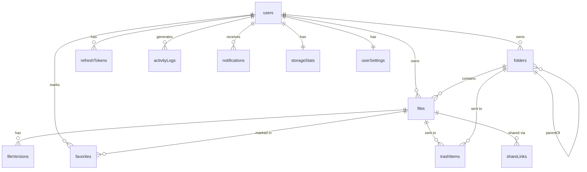

# Fileex — Database Design

**Version:** 1.3 | **Status:** Planning | **Last Updated:** 2026-06-30

---

## 1. Design Principles

- **Soft deletes everywhere** — `deletedAt` timestamp instead of hard deletes
- **Adjacency list for folders** — `parentId` self-reference enables infinite nesting
- **Metadata decoupled from blobs** — S3 key stored in DB; actual file data lives in S3
- **Audit trail built-in** — `activityLogs` table captures all operations
- **Storage tracking** — `storageStats` aggregated per user for fast dashboard queries
- **Future-ready** — `fileVersions` table reserved; `workspaceId` column stubs prepared

---

## 2. Entity Relationship Diagram



---

## 3. Table Definitions

### 3.1 `users`

| Column | Type | Constraints | Notes |
|---|---|---|---|
| id | VARCHAR(36) | PK | UUID v4 |
| email | VARCHAR(255) | UNIQUE, NOT NULL | Login identifier |
| passwordHash | VARCHAR(255) | NOT NULL | bcrypt hash |
| firstName | VARCHAR(100) | NOT NULL | |
| lastName | VARCHAR(100) | NOT NULL | |
| avatarUrl | VARCHAR(500) | NULLABLE | S3 URL or null |
| storageQuotaBytes | BIGINT | DEFAULT 5368709120 | Default: 5 GB |
| isActive | BOOLEAN | DEFAULT TRUE | |
| createdAt | DATETIME | DEFAULT NOW() | |
| updatedAt | DATETIME | AUTO UPDATE | |

**Indexes:** `email` (UNIQUE)

---

### 3.2 `refresh_tokens`

| Column | Type | Constraints | Notes |
|---|---|---|---|
| id | VARCHAR(36) | PK | UUID v4 |
| userId | VARCHAR(36) | FK → users.id | |
| tokenHash | VARCHAR(255) | NOT NULL | SHA-256 hash of raw token |
| expiresAt | DATETIME | NOT NULL | |
| isRevoked | BOOLEAN | DEFAULT FALSE | |
| createdAt | DATETIME | DEFAULT NOW() | |

**Indexes:** `userId`, `tokenHash`

---

### 3.3 `folders`

| Column | Type | Constraints | Notes |
|---|---|---|---|
| id | VARCHAR(36) | PK | UUID v4 |
| userId | VARCHAR(36) | FK → users.id | Owner |
| parentId | VARCHAR(36) | FK → folders.id, NULLABLE | NULL = root |
| name | VARCHAR(255) | NOT NULL | |
| color | VARCHAR(7) | NULLABLE | Hex color |
| deletedAt | DATETIME | NULLABLE | Soft delete |
| createdAt | DATETIME | DEFAULT NOW() | |
| updatedAt | DATETIME | AUTO UPDATE | |

**Indexes:** `userId`, `parentId`, `(userId, parentId)` composite  
**Unique Constraint:** `(userId, parentId, name)` — case-insensitive enforced at service layer

---

### 3.4 `files`

Updated in v1.3: Added `lastAccessedAt` and `checksum` fields.

| Column | Type | Constraints | Notes |
|---|---|---|---|
| id | VARCHAR(36) | PK | UUID v4 |
| userId | VARCHAR(36) | FK → users.id | Owner |
| folderId | VARCHAR(36) | FK → folders.id, NULLABLE | NULL = root |
| name | VARCHAR(255) | NOT NULL | Display name |
| originalName | VARCHAR(255) | NOT NULL | Name at upload time |
| s3Key | VARCHAR(1000) | NOT NULL | Full S3 object key |
| mimeType | VARCHAR(127) | NOT NULL | e.g. `image/jpeg` |
| extension | VARCHAR(20) | NOT NULL | e.g. `jpg` |
| sizeBytes | BIGINT | NOT NULL | File size in bytes |
| uploadStatus | ENUM | NOT NULL | `pending`, `confirmed`, `failed` |
| isFavorited | BOOLEAN | DEFAULT FALSE | Denormalized fast read |
| **lastAccessedAt** | DATETIME | NULLABLE | *(new — see note below)* |
| **checksum** | VARCHAR(64) | NULLABLE | *(new — see note below)* |
| deletedAt | DATETIME | NULLABLE | Soft delete |
| createdAt | DATETIME | DEFAULT NOW() | |
| updatedAt | DATETIME | AUTO UPDATE | |

**Indexes:** `userId`, `folderId`, `(userId, folderId)` composite, `uploadStatus`, `mimeType`, `deletedAt`  
**Unique Constraint:** `(userId, folderId, name)` — case-insensitive enforced at service layer

#### Why `lastAccessedAt`?
- Tracks the most recent time a user downloaded or previewed the file
- Enables "Recently Accessed" views (common in file managers like Finder / Explorer)
- Useful for future analytics and smart sorting ("Last Opened")
- Updated on `GET /files/:id/download-url` and `GET /files/:id/preview-url`
- Nullable — null means the file was uploaded but never accessed

#### Why `checksum`?
- Stores the SHA-256 hash of the file content, computed at upload confirmation
- **Integrity verification:** Allows the system to detect if an S3 object was corrupted or tampered with
- **Duplicate detection (future):** Enables server-side deduplication — if two files have the same checksum, they can share the same S3 object (single-instance storage)
- **Client-side pre-check (future):** Client can compute checksum before uploading; if it matches an existing file, skip the upload entirely
- Nullable in v1 because checksum computation is done async post-confirmation; not computed for legacy/existing files

---

### 3.5 `file_versions` *(Reserved for v2)*

| Column | Type | Constraints | Notes |
|---|---|---|---|
| id | VARCHAR(36) | PK | UUID v4 |
| fileId | VARCHAR(36) | FK → files.id | |
| versionNumber | INT | NOT NULL | Monotonically increasing |
| s3Key | VARCHAR(1000) | NOT NULL | Version-specific S3 key |
| sizeBytes | BIGINT | NOT NULL | |
| checksum | VARCHAR(64) | NULLABLE | SHA-256 of this version |
| uploadedAt | DATETIME | NOT NULL | |
| uploadedBy | VARCHAR(36) | FK → users.id | |

*Table defined; no application code touches it until v2.*

---

### 3.6 `trash_items`

| Column | Type | Constraints | Notes |
|---|---|---|---|
| id | VARCHAR(36) | PK | UUID v4 |
| userId | VARCHAR(36) | FK → users.id | |
| itemId | VARCHAR(36) | NOT NULL | File or folder ID |
| itemType | ENUM | NOT NULL | `file` or `folder` |
| originalParentId | VARCHAR(36) | NULLABLE | Parent at delete time |
| originalName | VARCHAR(255) | NOT NULL | Name at delete time |
| deletedAt | DATETIME | DEFAULT NOW() | |
| scheduledPurgeAt | DATETIME | NOT NULL | `deletedAt + 30 days` |

**Indexes:** `userId`, `scheduledPurgeAt`

---

### 3.7 `activity_logs`

| Column | Type | Constraints | Notes |
|---|---|---|---|
| id | VARCHAR(36) | PK | UUID v4 |
| userId | VARCHAR(36) | FK → users.id | Actor |
| action | ENUM | NOT NULL | See enum below |
| itemId | VARCHAR(36) | NOT NULL | File or folder ID |
| itemType | ENUM | NOT NULL | `file` or `folder` |
| itemName | VARCHAR(255) | NOT NULL | Snapshot of name |
| metadata | JSON | NULLABLE | Extra context |
| createdAt | DATETIME | DEFAULT NOW() | |

**Action Enum:** `upload`, `download`, `rename`, `delete`, `restore`, `move`, `copy`, `duplicate`, `create_folder`, `preview`, `favorite`, `unfavorite`, `permanent_delete`

**Indexes:** `userId`, `createdAt`, `(userId, createdAt)` composite

---

### 3.8 `favorites`

| Column | Type | Constraints | Notes |
|---|---|---|---|
| id | VARCHAR(36) | PK | UUID v4 |
| userId | VARCHAR(36) | FK → users.id | |
| fileId | VARCHAR(36) | FK → files.id | |
| createdAt | DATETIME | DEFAULT NOW() | |

**Indexes:** `(userId, fileId)` UNIQUE composite

---

### 3.9 `storage_stats`

| Column | Type | Constraints | Notes |
|---|---|---|---|
| userId | VARCHAR(36) | PK, FK → users.id | |
| usedBytes | BIGINT | DEFAULT 0 | Total used |
| imageBytes | BIGINT | DEFAULT 0 | |
| videoBytes | BIGINT | DEFAULT 0 | |
| audioBytes | BIGINT | DEFAULT 0 | |
| documentBytes | BIGINT | DEFAULT 0 | |
| otherBytes | BIGINT | DEFAULT 0 | |
| fileCount | INT | DEFAULT 0 | |
| updatedAt | DATETIME | AUTO UPDATE | |

---

### 3.10 `share_links` *(P2 / v2)*

| Column | Type | Constraints | Notes |
|---|---|---|---|
| id | VARCHAR(36) | PK | UUID v4 |
| fileId | VARCHAR(36) | FK → files.id | |
| userId | VARCHAR(36) | FK → users.id | Creator |
| token | VARCHAR(64) | UNIQUE | Random URL-safe token |
| expiresAt | DATETIME | NULLABLE | |
| downloadCount | INT | DEFAULT 0 | |
| isActive | BOOLEAN | DEFAULT TRUE | |
| createdAt | DATETIME | DEFAULT NOW() | |

---

### 3.11 `user_settings` *(New in v1.3)*

Stores per-user preferences. One row per user (1:1 with `users`). Created with defaults on registration.

| Column | Type | Constraints | Notes |
|---|---|---|---|
| userId | VARCHAR(36) | PK, FK → users.id | |
| theme | ENUM | DEFAULT `system` | `light`, `dark`, `system` |
| defaultView | ENUM | DEFAULT `grid` | `grid`, `list` |
| defaultSortBy | ENUM | DEFAULT `name` | `name`, `size`, `createdAt`, `extension` |
| defaultSortDir | ENUM | DEFAULT `asc` | `asc`, `desc` |
| language | VARCHAR(10) | DEFAULT `en` | BCP 47 locale code — stub for v3 i18n |
| updatedAt | DATETIME | AUTO UPDATE | |

> **Design Note:** `language` column is reserved but has no effect in v1. No i18n infrastructure is built in v1. The column exists so future language support requires only a migration-free data change.

> **Design Note:** Settings are fetched on login and stored in client state (Zustand). UI-critical settings (`theme`, `defaultView`) are additionally written to `localStorage` for zero-flash initial render before the API response arrives.

---

### 3.12 `notifications` *(New in v1.3)*

Stores in-app notifications. Poll-based in v1; WebSocket delivery in v3.

| Column | Type | Constraints | Notes |
|---|---|---|---|
| id | VARCHAR(36) | PK | UUID v4 |
| userId | VARCHAR(36) | FK → users.id | Recipient |
| type | ENUM | NOT NULL | See notification type enum |
| title | VARCHAR(255) | NOT NULL | Short notification title |
| body | VARCHAR(500) | NULLABLE | Optional longer message |
| isRead | BOOLEAN | DEFAULT FALSE | |
| metadata | JSON | NULLABLE | Contextual data (fileId, folderId, etc.) |
| createdAt | DATETIME | DEFAULT NOW() | |

**Notification Type Enum:**
`upload_complete`, `upload_failed`, `download_started`, `delete_success`, `folder_created`, `item_renamed`, `item_moved`, `copy_complete`, `quota_warning`, `quota_exceeded`, `bulk_delete_complete`, `error`

**Indexes:** `userId`, `isRead`, `(userId, isRead)` composite, `createdAt`

> **Design Note:** Notifications are created within the same service transaction as the triggering operation (e.g., upload confirm → create notification atomically). This guarantees no orphaned notifications and no missed notifications.

> **Retention Policy:** Notifications older than 90 days are automatically purged. Purge is performed by a scheduled job (cron), not a DB trigger.

---

## 4. Prisma Schema (Key Additions for v1.3)

```prisma
model UserSettings {
  userId        String   @id
  theme         Theme    @default(system)
  defaultView   ViewMode @default(grid)
  defaultSortBy SortBy   @default(name)
  defaultSortDir SortDir @default(asc)
  language      String   @default("en")
  updatedAt     DateTime @updatedAt
  user          User     @relation(fields: [userId], references: [id])
}

enum Theme { light dark system }
enum ViewMode { grid list }
enum SortBy { name size createdAt extension }
enum SortDir { asc desc }

model Notification {
  id        String           @id @default(uuid())
  userId    String
  type      NotificationType
  title     String
  body      String?
  isRead    Boolean          @default(false)
  metadata  Json?
  createdAt DateTime         @default(now())
  user      User             @relation(fields: [userId], references: [id])

  @@index([userId, isRead])
}

enum NotificationType {
  upload_complete
  upload_failed
  download_started
  delete_success
  folder_created
  item_renamed
  item_moved
  copy_complete
  quota_warning
  quota_exceeded
  bulk_delete_complete
  error
}

// Updated File model additions:
model File {
  // ... existing fields ...
  lastAccessedAt DateTime?
  checksum       String?   // SHA-256, max 64 chars
}
```

---

## 5. Key Query Patterns (Updated)

| Query | Approach |
|---|---|
| List files in folder | `WHERE folderId = ? AND deletedAt IS NULL ORDER BY ?` |
| Get folder breadcrumb | Recursive CTE on `parentId` |
| Search by name | `WHERE name LIKE ? AND userId = ? AND deletedAt IS NULL` |
| Storage dashboard | Read `storageStats` (O(1)) |
| Recent uploads | `ORDER BY createdAt DESC LIMIT 10` |
| Recently accessed | `ORDER BY lastAccessedAt DESC LIMIT 10` (new) |
| Trash items | `WHERE deletedAt IS NOT NULL AND userId = ?` |
| Favorites | JOIN `favorites` with `files` |
| Activity feed | `WHERE userId = ? ORDER BY createdAt DESC LIMIT 50` |
| Unread notifications | `WHERE userId = ? AND isRead = FALSE ORDER BY createdAt DESC` |
| User settings | `WHERE userId = ?` (single row, always exists) |
| Name conflict check | `WHERE userId = ? AND folderId = ? AND LOWER(name) = LOWER(?) AND deletedAt IS NULL` |

---

## 6. Migration Strategy

- All schema changes via **Prisma Migrations** (versioned, reviewable)
- `prisma migrate dev` for development
- `prisma migrate deploy` for production (no auto-reset)
- Seed data via `prisma/seed.ts`
- `user_settings` row created in same transaction as `users` row on registration

---

## 7. Future Schema Extensions

| Feature | Schema Change |
|---|---|
| File Versioning | `fileVersions` table already defined — activate in v2 |
| Team Workspaces | Add `workspaces`, `workspaceMembers`; add `workspaceId` FK to `files/folders` |
| Comments | Add `comments` table with `fileId`, `userId`, `body` |
| Real-time Sync | Add `syncEvents` event log table |
| Deduplication | Use `checksum` to link multiple `files` rows to one S3 object |
