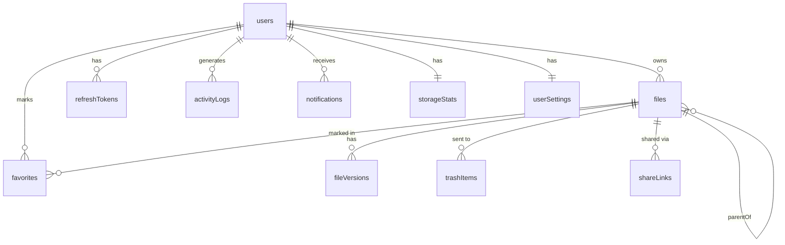

# Fileex — Database Design

**Version:** 1.4 | **Status:** Finalized | **Last Updated:** 2026-07-08

---

## 1. Design Principles

- **Soft deletes everywhere** — `deletedAt` timestamp instead of hard deletes
- **Adjacency list for folders** — `parentId` self-reference enables infinite nesting
- **Metadata decoupled from blobs** — S3 key stored in DB; actual file data lives in S3
- **Audit trail built-in** — `activityLogs` table captures all operations
- **Storage tracking** — `storageStats` aggregated per user for fast dashboard queries
- **Future-ready** — `fileVersions` table reserved; `workspaceId` column stubs prepared

---

## 2. Entity Relationship Diagram



---

## 3. Table Definitions

### 3.1 `users`

| Column | Type | Constraints | Notes |
|---|---|---|---|
| id | VARCHAR(36) | PK | cuid() |
| name | VARCHAR(100) | NOT NULL | Display name |
| email | VARCHAR(255) | UNIQUE, NOT NULL | Login identifier |
| hashedPassword | VARCHAR(255) | NOT NULL | bcrypt hash (10 rounds) |
| avatarUrl | VARCHAR(500) | NULLABLE | S3 URL or null |
| createdAt | DATETIME | DEFAULT NOW() | |
| updatedAt | DATETIME | AUTO UPDATE | |

**Indexes:** `email` (UNIQUE)

---

### 3.2 `refresh_tokens`

| Column | Type | Constraints | Notes |
|---|---|---|---|
| id | VARCHAR(36) | PK | UUID v4 |
| userId | VARCHAR(36) | FK → users.id | |
| tokenHash | VARCHAR(255) | NOT NULL | SHA-256 hash of raw token |
| expiresAt | DATETIME | NOT NULL | |
| isRevoked | BOOLEAN | DEFAULT FALSE | |
| createdAt | DATETIME | DEFAULT NOW() | |

**Indexes:** `userId`, `tokenHash`

---

### 3.3 `files` (Unified File & Folder Model)

Updated in v1.3: Unified File and Folder tables into a single `files` table.

| Column | Type | Constraints | Notes |
|---|---|---|---|
| id | INT | PK, AUTO_INCREMENT | |
| ownerId | VARCHAR(36) | FK → users.id | Owner of the item |
| parentId | INT | FK → files.id, NULLABLE | Self-referencing (NULL = root) |
| displayName | VARCHAR(255) | NOT NULL | User-visible name |
| storageKey | VARCHAR(1000) | NULLABLE | Immutable S3 object key (null for folders) |
| mimeType | VARCHAR(127) | NULLABLE | e.g. `application/pdf` (null for folders) |
| size | BIGINT | NOT NULL | File size in bytes (0 for folders) |
| type | ENUM | NOT NULL | `FILE` or `FOLDER` |
| status | ENUM | NOT NULL | `PENDING`, `READY`, `FAILED` |
| uploadStartedAt | DATETIME | NULLABLE | Default `now()` — used for future cleanup strategies |
| deletedAt | DATETIME | NULLABLE | NULL = active; NOT NULL = in Trash (soft delete) |
| createdAt | DATETIME | DEFAULT NOW() | |
| updatedAt | DATETIME | AUTO UPDATE | |

**Indexes:** `ownerId`, `parentId`, `status`, `deletedAt`  
**Unique Constraint:** `@@unique([ownerId, parentId, displayName])` — prevents duplicate names in the same folder.

**Prisma defaults:** `type = FILE`, `size = 0`, `status = PENDING`, `uploadStartedAt = now()`, `deletedAt = NULL`

#### Enums
**FileType:** `FILE`, `FOLDER`  
**FileStatus:** `PENDING`, `READY`, `FAILED`  

> **Note:** `DELETED` is NOT part of `FileStatus`. Deletion is handled by `deletedAt` (soft delete). File status tracks upload state only.

#### Service Layer Rules
| Rule | FILE | FOLDER |
|---|---|---|
| `storageKey` | Required (immutable after creation) | Must be `NULL` |
| `mimeType` | Required | Must be `NULL` |
| `size` | Must be `> 0` | Must be `0` |

These validations are enforced in the **Service layer**, not the database.

#### storageKey Format
`users/{userId}/files/{uuid}`  
The `storageKey` is immutable. Rename only updates `displayName`. Move only updates `parentId`. No S3 rename or move operation is ever performed.

---

### 3.4 `deletedAt` (Soft Delete Pattern)

The `files` table uses `deletedAt` for soft deletes. This is separate from `FileStatus`.

- `deletedAt = NULL` → Active item
- `deletedAt IS NOT NULL` → Item is in Trash

All file listing queries filter `WHERE deletedAt IS NULL`. This is enforced at the repository layer. The `deletedAt` timestamp is set when a user moves an item to Trash. The actual S3 object is only deleted on permanent delete.

---

### 3.5 `file_versions` *(Reserved for v2)*

| Column | Type | Constraints | Notes |
|---|---|---|---|
| id | VARCHAR(36) | PK | UUID v4 |
| fileId | INT | FK → files.id | |
| versionNumber | INT | NOT NULL | Monotonically increasing |
| s3Key | VARCHAR(1000) | NOT NULL | Version-specific S3 key |
| sizeBytes | BIGINT | NOT NULL | |
| checksum | VARCHAR(64) | NULLABLE | SHA-256 of this version |
| uploadedAt | DATETIME | NOT NULL | |
| uploadedBy | VARCHAR(36) | FK → users.id | |

*Table defined; no application code touches it until v2.*

---

### 3.6 `trash_items`

| Column | Type | Constraints | Notes |
|---|---|---|---|
| id | VARCHAR(36) | PK | UUID v4 |
| userId | VARCHAR(36) | FK → users.id | |
| itemId | INT | FK → files.id | ID of the trashed file/folder |
| originalParentId | INT | FK → files.id, NULLABLE | Parent at delete time (NULL = was at root) |
| originalName | VARCHAR(255) | NOT NULL | `displayName` at delete time |
| deletedAt | DATETIME | DEFAULT NOW() | When user moved to Trash |
| scheduledPurgeAt | DATETIME | NOT NULL | `deletedAt + 30 days` |

**Indexes:** `userId`, `scheduledPurgeAt`

---

### 3.7 `activity_logs`

| Column | Type | Constraints | Notes |
|---|---|---|---|
| id | VARCHAR(36) | PK | UUID v4 |
| userId | VARCHAR(36) | FK → users.id | Actor |
| action | ENUM | NOT NULL | See enum below |
| itemId | INT | FK → files.id | ID of the affected file/folder |
| itemName | VARCHAR(255) | NOT NULL | Snapshot of `displayName` at action time |
| metadata | JSON | NULLABLE | Extra context |
| createdAt | DATETIME | DEFAULT NOW() | |

**Action Enum:** `upload`, `download`, `rename`, `delete`, `restore`, `move`, `copy`, `duplicate`, `create_folder`, `preview`, `favorite`, `unfavorite`, `permanent_delete`

**Indexes:** `userId`, `createdAt`, `(userId, createdAt)` composite

---

### 3.8 `favorites`

| Column | Type | Constraints | Notes |
|---|---|---|---|
| id | VARCHAR(36) | PK | UUID v4 |
| userId | VARCHAR(36) | FK → users.id | |
| fileId | INT | FK → files.id | |
| createdAt | DATETIME | DEFAULT NOW() | |

**Indexes:** `(userId, fileId)` UNIQUE composite

---

### 3.9 `storage_stats`

| Column | Type | Constraints | Notes |
|---|---|---|---|
| id | VARCHAR(36) | PK | UUID v4 |
| userId | VARCHAR(36) | UNIQUE, FK → users.id | |
| usedStorage | BIGINT | DEFAULT 0 | Updated only after `POST /upload/complete` |
| storageLimit | BIGINT | DEFAULT 104857600 | 100 MB default quota. Quota checked before upload. |
| createdAt | DATETIME | DEFAULT NOW() | |
| updatedAt | DATETIME | AUTO UPDATE | |

---

### 3.10 `share_links` *(P2 / v2)*

| Column | Type | Constraints | Notes |
|---|---|---|---|
| id | VARCHAR(36) | PK | UUID v4 |
| fileId | INT | FK → files.id | |
| userId | VARCHAR(36) | FK → users.id | Creator |
| token | VARCHAR(64) | UNIQUE | Random URL-safe token |
| expiresAt | DATETIME | NULLABLE | |
| downloadCount | INT | DEFAULT 0 | |
| isActive | BOOLEAN | DEFAULT TRUE | |
| createdAt | DATETIME | DEFAULT NOW() | |

---

### 3.11 `user_settings` *(New in v1.3)*

Stores per-user preferences. One row per user (1:1 with `users`). Created with defaults on registration.

| Column | Type | Constraints | Notes |
|---|---|---|---|
| userId | VARCHAR(36) | PK, FK → users.id | |
| theme | ENUM | DEFAULT `system` | `light`, `dark`, `system` |
| defaultView | ENUM | DEFAULT `grid` | `grid`, `list` |
| defaultSortBy | ENUM | DEFAULT `name` | `name`, `size`, `createdAt`, `extension` |
| defaultSortDir | ENUM | DEFAULT `asc` | `asc`, `desc` |
| language | VARCHAR(10) | DEFAULT `en` | BCP 47 locale code — stub for v3 i18n |
| updatedAt | DATETIME | AUTO UPDATE | |

> **Design Note:** `language` column is reserved but has no effect in v1. No i18n infrastructure is built in v1. The column exists so future language support requires only a migration-free data change.

> **Design Note:** Settings are fetched on login and stored in client state (Zustand). UI-critical settings (`theme`, `defaultView`) are additionally written to `localStorage` for zero-flash initial render before the API response arrives.

---

### 3.12 `notifications` *(New in v1.3)*

Stores in-app notifications. Poll-based in v1; WebSocket delivery in v3.

| Column | Type | Constraints | Notes |
|---|---|---|---|
| id | VARCHAR(36) | PK | UUID v4 |
| userId | VARCHAR(36) | FK → users.id | Recipient |
| type | ENUM | NOT NULL | See notification type enum |
| title | VARCHAR(255) | NOT NULL | Short notification title |
| body | VARCHAR(500) | NULLABLE | Optional longer message |
| isRead | BOOLEAN | DEFAULT FALSE | |
| metadata | JSON | NULLABLE | Contextual data (fileId as INT, parentId as INT) |
| createdAt | DATETIME | DEFAULT NOW() | |

**Notification Type Enum:**
`upload_complete`, `upload_failed`, `download_started`, `delete_success`, `folder_created`, `item_renamed`, `item_moved`, `copy_complete`, `quota_warning`, `quota_exceeded`, `bulk_delete_complete`, `error`

**Indexes:** `userId`, `isRead`, `(userId, isRead)` composite, `createdAt`

> **Design Note:** Notifications are created within the same service transaction as the triggering operation (e.g., upload confirm → create notification atomically). This guarantees no orphaned notifications and no missed notifications.

> **Retention Policy:** Notifications older than 90 days are automatically purged. Purge is performed by a scheduled job (cron), not a DB trigger.

---

## 4. Prisma Schema (Key Additions for v1.3)

```prisma
model UserSettings {
  userId        String   @id
  theme         Theme    @default(system)
  defaultView   ViewMode @default(grid)
  defaultSortBy SortBy   @default(name)
  defaultSortDir SortDir @default(asc)
  language      String   @default("en")
  updatedAt     DateTime @updatedAt
  user          User     @relation(fields: [userId], references: [id])
}

enum Theme { light dark system }
enum ViewMode { grid list }
enum SortBy { name size createdAt extension }
enum SortDir { asc desc }

model Notification {
  id        String           @id @default(uuid())
  userId    String
  type      NotificationType
  title     String
  body      String?
  isRead    Boolean          @default(false)
  metadata  Json?
  createdAt DateTime         @default(now())
  user      User             @relation(fields: [userId], references: [id])

  @@index([userId, isRead])
}

enum NotificationType {
  upload_complete
  upload_failed
  download_started
  delete_success
  folder_created
  item_renamed
  item_moved
  copy_complete
  quota_warning
  quota_exceeded
  bulk_delete_complete
  error
}

// Unified File and Folder model
model File {
  id              Int        @id @default(autoincrement())
  ownerId         String
  parentId        Int?
  displayName     String
  storageKey      String?
  mimeType        String?
  size            BigInt     @default(0)
  type            FileType   @default(FILE)
  status          FileStatus @default(PENDING)
  uploadStartedAt DateTime?  @default(now())
  deletedAt       DateTime?                    // NULL = active; NOT NULL = in Trash
  createdAt       DateTime   @default(now())
  updatedAt       DateTime   @updatedAt

  owner           User       @relation(fields: [ownerId], references: [id])
  parent          File?      @relation("FileHierarchy", fields: [parentId], references: [id])
  children        File[]     @relation("FileHierarchy")

  @@index([ownerId])
  @@index([parentId])
  @@index([status])
  @@index([deletedAt])
  @@unique([ownerId, parentId, displayName])
}

enum FileType {
  FILE
  FOLDER
}

enum FileStatus {
  PENDING
  READY
  FAILED
  // DELETED is intentionally omitted.
  // Deletion state is represented by deletedAt (soft delete), not upload status.
}
```

---

## 5. Key Query Patterns (Updated)

| Query | Approach |
|---|---|
| List files in folder | `WHERE parentId = ? AND ownerId = ? AND deletedAt IS NULL ORDER BY ?` |
| Get folder breadcrumb | Recursive CTE on `parentId` |
| Search by name | `WHERE displayName LIKE ? AND ownerId = ? AND deletedAt IS NULL` |
| Storage dashboard | Read `storageStats` (O(1)) |
| Recent uploads | `ORDER BY createdAt DESC LIMIT 10 WHERE status = READY` |
| Trash items | `WHERE deletedAt IS NOT NULL AND ownerId = ?` |
| Favorites | JOIN `favorites` with `files` |
| Activity feed | `WHERE userId = ? ORDER BY createdAt DESC LIMIT 50` |
| Unread notifications | `WHERE userId = ? AND isRead = FALSE ORDER BY createdAt DESC` |
| User settings | `WHERE userId = ?` (single row, always exists) |
| Name conflict check | `WHERE ownerId = ? AND parentId = ? AND LOWER(displayName) = LOWER(?) AND deletedAt IS NULL` |
| Upload recovery | `WHERE status = PENDING AND ownerId = ?` — verify each S3 object on listing |

---

## 6. Migration Strategy

- All schema changes via **Prisma Migrations** (versioned, reviewable)
- `prisma migrate dev` for development
- `prisma migrate deploy` for production (no auto-reset)
- Seed data via `prisma/seed.ts`
- `user_settings` row created in same transaction as `users` row on registration

---

## 7. Future Schema Extensions

| Feature | Schema Change |
|---|---|
| File Versioning | `fileVersions` table already defined — activate in v2 |
| Team Workspaces | Add `workspaces`, `workspaceMembers`; add `workspaceId` FK to `files/folders` |
| Comments | Add `comments` table with `fileId`, `userId`, `body` |
| Real-time Sync | Add `syncEvents` event log table |
| Deduplication | Use `checksum` to link multiple `files` rows to one S3 object |
