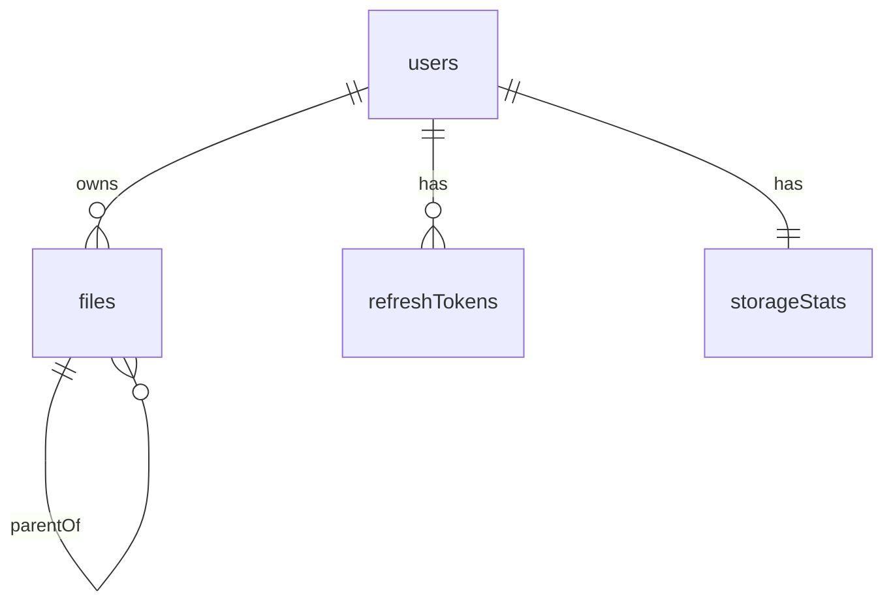

# Fileex — Database Design

**Version:** 1.4 | **Status:** Finalized | **Last Updated:** 2026-08-05

---

## 1. Design Principles

- **Soft deletes via `deletedAt`** — `deletedAt = NULL` means active; `deletedAt IS NOT NULL` means in Trash. There is no separate `trash_items` table.
- **Unified File & Folder model** — Files and folders are stored in the same `files` table, distinguished by `type = FILE` or `type = FOLDER`. There is no separate `folders` table.
- **Adjacency list for hierarchy** — `parentId` self-reference on `files` enables infinite nesting. `parentId = NULL` means the item is at the virtual root.
- **Metadata decoupled from blobs** — S3 key stored in DB; actual file data lives in S3
- **Storage tracking** — `storage_stats` aggregated per user for fast quota queries
- **Future-ready** — `fileVersions` table reserved; `workspaceId` column stubs prepared

---

## 2. Entity Relationship Diagram



> Tables for `activityLogs`, `favorites`, `notifications`, `userSettings`, `shareLinks`, and `fileVersions` are planned for v2 and are not yet present in the Prisma schema.

---

## 3. Table Definitions

### 3.1 `users`

| Column | Type | Constraints | Notes |
|---|---|---|---|
| id | VARCHAR(36) | PK | cuid() |
| name | VARCHAR(100) | NOT NULL | Display name |
| email | VARCHAR(255) | UNIQUE, NOT NULL | Login identifier |
| hashedPassword | VARCHAR(255) | NOT NULL | bcrypt hash (10 rounds) |
| avatarUrl | VARCHAR(500) | NULLABLE | S3 URL or null |
| createdAt | DATETIME | DEFAULT NOW() | |
| updatedAt | DATETIME | AUTO UPDATE | |

**Indexes:** `email` (UNIQUE)

---

### 3.2 `refresh_tokens`

| Column | Type | Constraints | Notes |
|---|---|---|---|
| id | VARCHAR(36) | PK | cuid() |
| userId | VARCHAR(36) | FK → users.id | |
| tokenHash | VARCHAR(64) | NOT NULL | SHA-256 hash of raw token |
| expiresAt | DATETIME | NOT NULL | |
| isRevoked | BOOLEAN | DEFAULT FALSE | |
| createdAt | DATETIME | DEFAULT NOW() | |

**Indexes:** `userId`, `tokenHash` (UNIQUE)

---

### 3.3 `files` (Unified File & Folder Model)

Files and folders are both stored in this single table. The `type` column determines which kind of item a row represents.

| Column | Type | Constraints | Notes |
|---|---|---|---|
| id | INT | PK, AUTO_INCREMENT | |
| ownerId | VARCHAR(36) | FK → users.id | Owner of the item |
| parentId | INT | FK → files.id, NULLABLE | Self-referencing (NULL = virtual root) |
| displayName | VARCHAR(255) | NOT NULL | User-visible name |
| storageKey | VARCHAR(512) | UNIQUE, NULLABLE | Immutable S3 object key (NULL for folders) |
| mimeType | VARCHAR(255) | NULLABLE | e.g. `application/pdf` (NULL for folders) |
| size | BIGINT | NOT NULL, DEFAULT 0 | File size in bytes (0 for folders) |
| type | ENUM | NOT NULL, DEFAULT FILE | `FILE` or `FOLDER` |
| status | ENUM | NOT NULL, DEFAULT PENDING | `PENDING`, `READY`, `FAILED` |
| uploadStartedAt | DATETIME | NULLABLE | Set by service on POST /upload/initiate; NULL for folders |
| deletedAt | DATETIME | NULLABLE | NULL = active; NOT NULL = in Trash (soft delete) |
| createdAt | DATETIME | DEFAULT NOW() | |
| updatedAt | DATETIME | AUTO UPDATE | |

**Indexes:** `ownerId`, `parentId`, `status`, `(ownerId, parentId)`, `(ownerId, deletedAt)`, `(parentId, deletedAt)`

> **Name uniqueness** is enforced in the **Service layer** (not via a database unique constraint) because soft-deleted items would otherwise block creation of new items with the same name in the same location.

#### Enums
**FileType:** `FILE`, `FOLDER`  
**FileStatus:** `PENDING`, `READY`, `FAILED`  

> **Note:** `DELETED` is NOT part of `FileStatus`. Deletion is handled by `deletedAt` (soft delete). `FileStatus` tracks upload lifecycle only.

#### Service Layer Rules
| Rule | FILE | FOLDER |
|---|---|---|
| `storageKey` | Required, immutable after creation | Must be `NULL` |
| `mimeType` | Required | Must be `NULL` |
| `size` | Must be `> 0` | Must be `0` |
| `status` on creation | `PENDING` (set by POST /upload/initiate) | `READY` (set immediately on creation) |
| `uploadStartedAt` | Set by service to `now()` | `NULL` |

These validations are enforced in the **Service layer**, not the database.

#### storageKey Format
`users/{userId}/files/{uuid}`  
The `storageKey` is immutable. Rename only updates `displayName`. Move only updates `parentId`. No S3 rename or move operation is ever performed.

---

### 3.4 Soft Delete Pattern

The `files` table uses `deletedAt` for soft deletes. **There is no separate `trash_items` table.**

- `deletedAt = NULL` → Active item
- `deletedAt IS NOT NULL` → Item is in Trash

All file listing queries filter `WHERE deletedAt IS NULL`. This is enforced at the repository layer. The `deletedAt` timestamp is set when a user moves an item to Trash. The actual S3 object is only deleted on permanent delete.

---

### 3.5 `storage_stats`

One row per user. Created atomically in the same transaction as the `users` row during registration.

| Column | Type | Constraints | Notes |
|---|---|---|---|
| id | INT | PK, AUTO_INCREMENT | |
| userId | VARCHAR(36) | UNIQUE, FK → users.id | |
| usedStorage | BIGINT | DEFAULT 0 | Updated atomically after `POST /upload/complete` |
| storageLimit | BIGINT | DEFAULT 104857600 | 100 MB default quota. Quota checked before upload. |
| createdAt | DATETIME | DEFAULT NOW() | |
| updatedAt | DATETIME | AUTO UPDATE | |

---

## 4. Prisma Schema (Implemented)

This is the current Prisma schema as implemented. It reflects only the models that are active in production.

```prisma
generator client {
  provider = "prisma-client-js"
}

datasource db {
  provider = "mysql"
  url      = env("DATABASE_URL")
}

enum FileType {
  FILE
  FOLDER
}

enum FileStatus {
  PENDING  // File record created; S3 PUT not yet confirmed
  READY    // S3 object confirmed present (or folder created); visible to user
  FAILED   // S3 PUT confirmed absent; file is unusable
  // DELETED is intentionally omitted — deletion is represented by deletedAt
}

model User {
  id             String   @id @default(cuid())
  name           String   @db.VarChar(100)
  email          String   @unique @db.VarChar(255)
  hashedPassword String
  avatarUrl      String?
  createdAt      DateTime @default(now())
  updatedAt      DateTime @updatedAt

  refreshTokens  RefreshToken[]
  files          File[]
  storageStats   StorageStats?

  @@map("users")
}

model RefreshToken {
  id        String   @id @default(cuid())
  userId    String
  tokenHash String   @unique @db.VarChar(64)
  expiresAt DateTime
  isRevoked Boolean  @default(false)
  createdAt DateTime @default(now())

  user      User     @relation(fields: [userId], references: [id], onDelete: Cascade)

  @@index([userId])
  @@map("refresh_tokens")
}

// Unified File and Folder model.
// Folders are rows with type = FOLDER; files are rows with type = FILE.
model File {
  id              Int        @id @default(autoincrement())
  ownerId         String
  parentId        Int?

  displayName     String     @db.VarChar(255)
  storageKey      String?    @unique @db.VarChar(512)  // NULL for folders; immutable for files
  mimeType        String?    @db.VarChar(255)          // NULL for folders
  size            BigInt     @default(0)               // 0 for folders; bytes for files
  type            FileType   @default(FILE)
  status          FileStatus @default(PENDING)         // Service sets READY for folders on creation
  uploadStartedAt DateTime?                            // NULL for folders; set by service for files
  deletedAt       DateTime?                            // NULL = active; NOT NULL = in Trash
  createdAt       DateTime   @default(now())
  updatedAt       DateTime   @updatedAt

  owner           User       @relation(fields: [ownerId], references: [id], onDelete: Cascade)
  parent          File?      @relation("FileHierarchy", fields: [parentId], references: [id], onDelete: NoAction, onUpdate: NoAction)
  children        File[]     @relation("FileHierarchy")

  @@index([ownerId])
  @@index([parentId])
  @@index([status])
  @@index([ownerId, parentId])
  @@index([ownerId, deletedAt])
  @@index([parentId, deletedAt])

  @@map("files")
}

model StorageStats {
  id           Int      @id @default(autoincrement())
  userId       String   @unique
  usedStorage  BigInt   @default(0)
  storageLimit BigInt   @default(104857600) // 100 MB in bytes
  createdAt    DateTime @default(now())
  updatedAt    DateTime @updatedAt

  user         User     @relation(fields: [userId], references: [id], onDelete: Cascade)

  @@map("storage_stats")
}
```

---

## 5. Key Query Patterns

| Query | Approach |
|---|---|
| List items in folder | `WHERE parentId = ? AND ownerId = ? AND deletedAt IS NULL ORDER BY type DESC, displayName ASC` |
| List root items | `WHERE parentId IS NULL AND ownerId = ? AND deletedAt IS NULL ORDER BY type DESC, displayName ASC` |
| Get item by ID (active) | `WHERE id = ? AND deletedAt IS NULL` |
| Storage dashboard | Read `storage_stats` (O(1)) |
| Recent uploads | `ORDER BY createdAt DESC WHERE status = READY AND deletedAt IS NULL` |
| Trash items | `WHERE deletedAt IS NOT NULL AND ownerId = ?` |
| Name conflict check | `WHERE ownerId = ? AND parentId = ? AND displayName = ? AND deletedAt IS NULL` |
| Upload recovery | `WHERE status = PENDING AND ownerId = ?` — verify each S3 object |
| Cycle detection (move) | Walk `parentId` chain upward from destination using `WHERE id = parentId AND deletedAt IS NULL` |

---

## 6. Migration Strategy

- All schema changes via **Prisma Migrations** (versioned, reviewable)
- `prisma migrate dev` for development
- `prisma migrate deploy` for production (no auto-reset)
- Seed data via `prisma/seed.js`

---

## 7. Future Schema Extensions (v2)

| Feature | Schema Change |
|---|---|
| File Versioning | Add `file_versions` table (see §3.5 of earlier drafts) |
| Trash Scheduling | Add `scheduledPurgeAt` computed column or application-level job using `deletedAt + 30 days` |
| Activity Log | Add `activity_logs` table: `userId`, `action` ENUM, `itemId` INT FK → `files.id` |
| Favorites | Add `favorites` table: `userId`, `fileId` INT FK → `files.id`, UNIQUE `(userId, fileId)` |
| Team Workspaces | Add `workspaces`, `workspaceMembers`; add `workspaceId` FK to `files` |
| User Settings | Add `user_settings` table: one row per user, created on registration |
| Notifications | Add `notifications` table for in-app messages |
| Sharing | Add `share_links` table with token, expiry, download count |
| Comments | Add `comments` table with `fileId` INT FK → `files.id`, `userId`, `body` |
| Real-time Sync | Add `syncEvents` event log table |
| Deduplication | Use `checksum` column to link multiple `files` rows to one S3 object |
